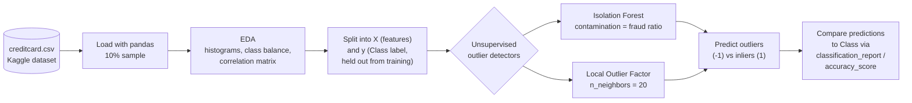

# Credit Card Fraud Detection

Unsupervised anomaly detection on the [Kaggle Credit Card Fraud
Detection](https://www.kaggle.com/mlg-ulb/creditcardfraud) dataset. A single
notebook loads the (PCA-anonymized) transaction data, explores class imbalance
and feature correlations, then fits two outlier-detection models — Isolation
Forest and Local Outlier Factor — to flag fraudulent transactions without
using the `Class` label during training.

## Tech stack

Python, pandas, NumPy, scikit-learn (`IsolationForest`, `LocalOutlierFactor`),
matplotlib, seaborn, SciPy, Jupyter Notebook.

## Architecture



The notebook treats fraud detection as an anomaly-detection problem: it
computes the empirical fraud ratio (`outlier_fraction`) from the data and
feeds it to both models as their expected contamination rate, then scores
each model's predictions against the true `Class` labels only for evaluation.

## Setup / How to run

The notebook expects `creditcard.csv` (the Kaggle dataset) in the same
directory — download it from Kaggle and place it alongside the notebook.

```bash
pip install numpy pandas matplotlib scipy seaborn scikit-learn jupyter
jupyter notebook "Credit Card Fraud Detection.ipynb"
```

Run all cells top to bottom; the notebook prints the fraud ratio, fits both
classifiers, and reports their outlier predictions.
